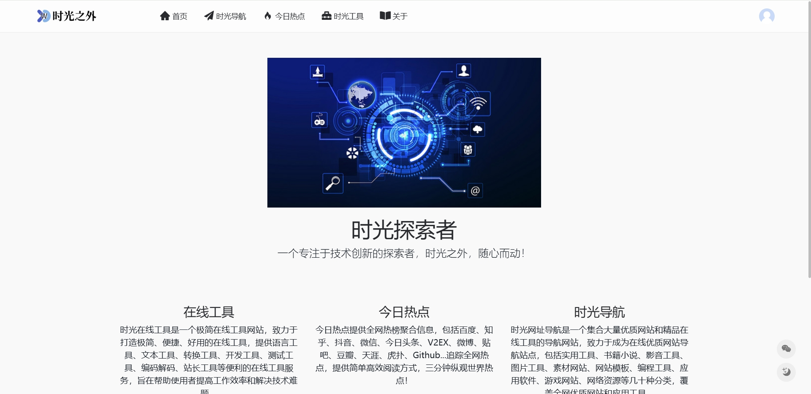
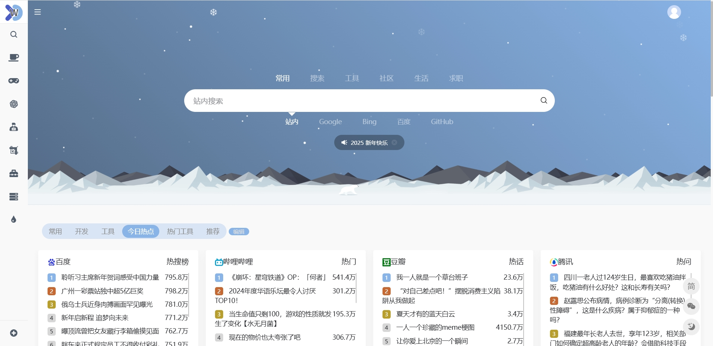

# 闲者

大家好，我是闲者，一个探索中的独立开发者！

## [时光之外 - 生命不息，探索不止！](https://wbtime.com/)

首页做的比较简单，仅仅是一个简单的展示页，感兴趣的朋友可以点击关于中的[问题反馈](https://www.wbtime.com/doc/jothw-)页面，进行留言！

## [时光导航 - 自由探索世界](https://nav.wbtime.com/)

时光导航 - 自由探索世界，因为浏览器上面的书签栏展示不方便，所以使用nav作为前缀，做了一个常用网址导航网站：时光导航，

目前导航页面上的数据是从后台获取的，暂时不支持自定义设置导航，后面会增加支持自定义设置导航。

2025.1.3 更新：目前已支持自定义导航和热点订阅

## [时光工具 - 好用的在线工具网站](https://tool.wbtime.com/)

一个好用的在线工具网站

## [今日热点 - 3分钟纵观世界](https://news.wbtime.com/)

##  [闲者博客 - 生活，如此而已！](https://blog.wbtime.com/)

博客当然是必不可少的了，因为之前想做的太多了，也太杂了，因此，失败了好几个网站，因此这个页面参考下面的模板，进行设计，当然，尊重版权，仅仅作为个人博客非商业使用。如果喜欢的小伙伴可以自行下载，不喜欢的地方进行更改。

[博客模板GitHub下载地址](https://github.com/EugeneGe/Blog-WBTime-Template.git)

## 联系方式

感兴趣的朋友可以关注下我的公众号或联系我，扫码添加，新消息会在公众号上发布的：[闲者何去](https://mp.weixin.qq.com/s?__biz=Mzk0MTQzOTIzNw==&mid=2247483804&idx=1&sn=0fb018f1defd2aaf6f04dba35dd0ed29&chksm=c2d321f6f5a4a8e07df0a245ed465a53a7d725ea9695cb160c45f742dbc371d52694686c8035&scene=126&sessionid=1702867566#rd)

## 赞赏

如果您觉得导航和博客做的还不错，想对我微小的付出一点激励，欢迎赞赏支持！

